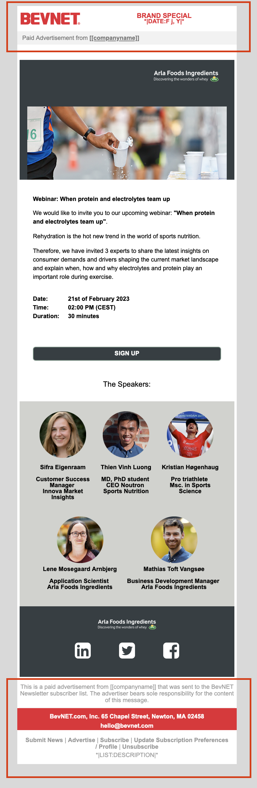

# BevNet Challenge

[BevNet](https://www.bevnet.com) coding challenge by Eduardo Aire Torres.

This repository contains the result of the challenge, it was created with the [mjml framework](https://mjml.io/) to make it as responsive as possible and to handle clients like Outlook. You can reach me out if there's any doubt about it at [hola@eduairet.com](mailto:hola@eduairet.com?subject=BevNet%20challenge%20Eduardo%20Aire)

## Content

1.  File provided by the recruiter: [index.html](./index.html)
2.  Source MJML file: [src/index.mjml](./src/index.mjml)
3.  MJML output file (challenge file): [src/index.html](./index.html)

## Explanation

-   The footer and header from the original file were not changed from the file provided by the recruiter

-   An NPM project was created to install the `MJML` dependency
-   The script `npm run build` was used to generate the `HTML` file to send in the email body
-   The script `npm run server` is used for development
-   The scripts `npm start` and `npm run server` are used for live development
